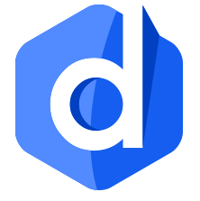

# dadamda-front
<center></center>

## 📰 세상의 모든 URL, '다담다'
> 소프트웨어 마에스트로 14기 <b><영원한 팀></b> <br/>
제작 기간 : 2023.03 ~

'다담다'는 모든 사이트의 URL을 담을 수 있고 여러 스크랩들을 모아 사용자가 보드를 꾸미고 공유할 수 있는 웹 서비스입니다.

## 서비스 링크

1. [베타 서비스 링크](https://dev.dadamda.me/)
2. [베타 서비스 신청 링크](https://forms.gle/rrqnNShVxzaRkQvq9)
3. [크롬 익스텐션](https://chrome.google.com/webstore/detail/dadamda/kgaiabolccidmgihificdfaimdlfmcfj?hl=ko)

## 시작 가이드
```
npm install
npm run dev
```

## 기술 스택
### 환경
<div style='display: flex, gap: 5px'>


</div>

   ### 개발
   <div style='display: flex, gap: 5px'>

 
  
  
  </div>

   ### 소통 및 관리
   <div style='display: flex, gap: 5px'>

 
  
  </div>

## 화면 구성
|전체 스크랩 페이지|상품 스크랩 페이지|
|:---:|:---:|
|||

|비디오 스크랩 페이지|아티클 스크랩 페이지|
|:---:|:---:|
|||

## 주요 기능
✨ 크롬 익스텐션을 통한 빠른 스크랩 추가 가능

✨ 스크랩 카테고리 맞춤 컨텐츠 제공

✨ '보드'를 통해 수집한 스크랩을 꾸미고, 타인에게 공유

✨ 타인의 보드를 보며 인사이트를 얻을 수 있는 트렌딩
